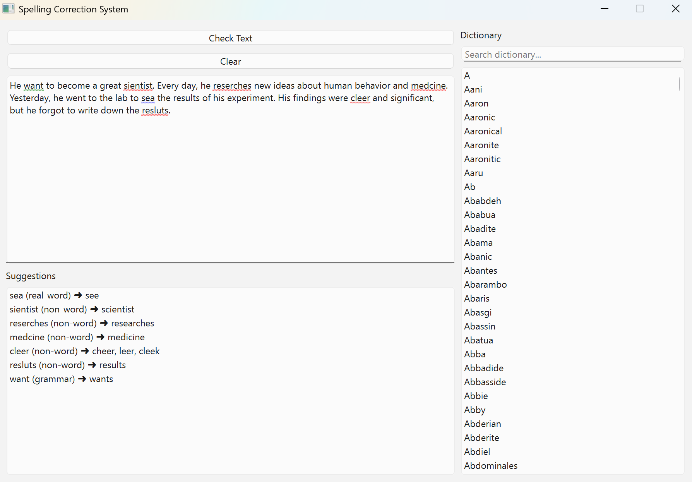

# 📝 Spelling Correction System

A smart, GUI-based spelling correction application built with **Python** and **PySide6**, capable of detecting and suggesting corrections for:
- ✅ Non-word spelling mistakes (e.g., `docotor` → `doctor`)
- ✅ Real-word/contextual errors using trigram probabilities (e.g., `sea` → `see` in "I want to sea a movie")

---

## 🔧 Features

- ✍️ Simple GUI text editor (500-character limit)
- 📚 Uses NLTK's Brown Corpus (100k+ words)
- 🧠 Supports:
  - Minimum Edit Distance (via `pyspellchecker`)
  - Bigram and Trigram language models
  - POS tagging for advanced detection
- 🎨 Color-coded highlights:
  - 🔴 Red = Non-word
  - 🟠 Orange = Real-word/contextual errors
  - 🟢 Green = Grammer errors
- 🔍 Dictionary viewer with search functionality

---

## 🖼️ Screenshot



---

## 📂 requirements.txt

```
PySide6
nltk
pyspellchecker
```

---

## 🛠️ Installation

### ✅ Requirements

Install required packages:

```bash
pip install -r requirements.txt
```

---

## ⬇️ First-Time NLTK Setup

Ensure these datasets are downloaded before first use:
```python
import nltk
nltk.download('punkt')
nltk.download('words')
nltk.download('brown')
nltk.download('averaged_perceptron_tagger')
```

---

## ▶️ Run the App

```bash
python main.py
```

---

## 🛠️ Build Windows `.exe` (Standalone)

Create a one-file Windows app with:
```bash
pip install pyinstaller
pyinstaller --onefile --windowed main.py
```

The `.exe` will be inside the `dist/` folder.

---

## 📚 Corpus & Techniques Used

- ✅ **Corpus**:
  - NLTK's Brown Corpus (contains over 1 million words)
  - Built-in dictionary from `nltk.corpus.words`

- 🧠 **Techniques**:
  - Minimum Edit Distance (for non-word detection)
  - Trigram language modeling (for real-word/contextual errors)
  - POS tagging with NLTK
  - Candidate ranking based on trigram probability

---

## 🧪 Example Test Inputs

```
I want to sea a movie.
Graffe is a strange animal.
The docotor gave me a perscription.
```

✅ Output: Underlined errors with suggestions like:
- sea ➜ see
- graffe ➜ giraffe
- docotor ➜ doctor

---

## 👨‍💻 Author

Thiha Soe Hlaing  
Asia Pacific University (APU), NLP Project  
2025